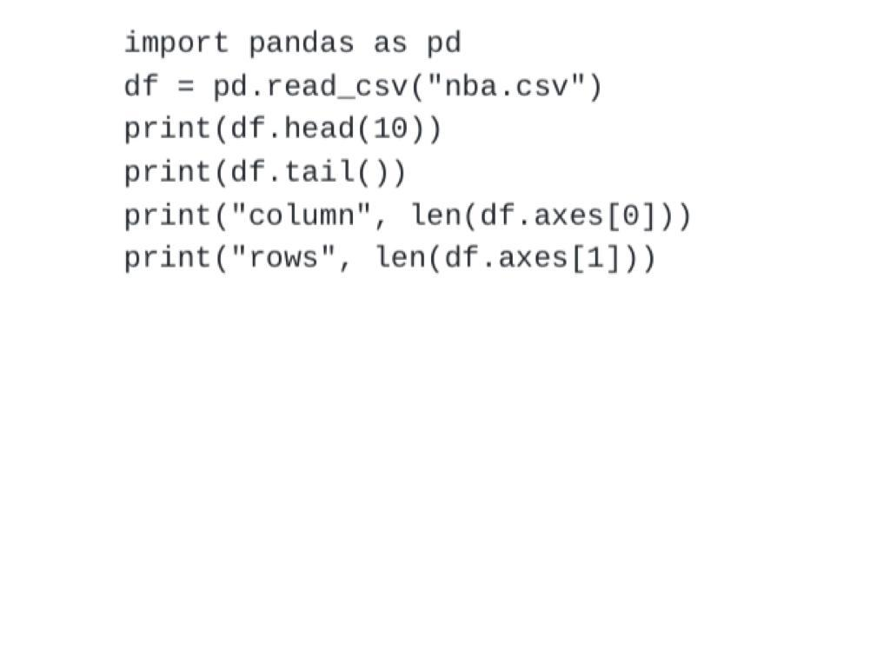
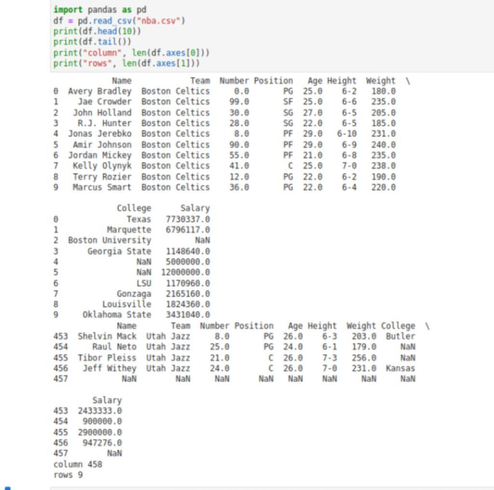

# Read-from-CSV

## AIM:
 To write a Python Program to read data from CSV file.

## ALGORITHM:
### Step 1:Start the python
### Step 2:Import pandas
### Step 3:Mention the CSV file which is to be read.
### Step 4:Read the contents of the CSV file using df.read function
### Step 5:End the program

## PROGRAM:
```
Developed by:karna s
Register Number:22008977
```


## OUTPUT:

## RESULT:
 A Python Program to read data from CSV files has been created successfully.
